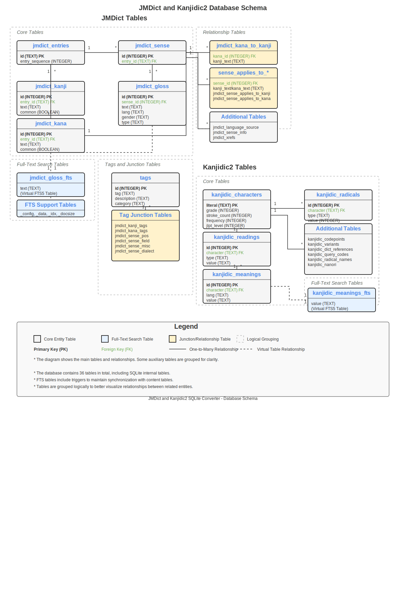

# JMDict and Kanjidic2 SQLite Converter

A tool to convert JMdict and Kanjidic2 JSON files from [jmdict-simplified](https://scriptin.github.io/jmdict-simplified/) into a SQLite database for efficient searching and retrieval.

## Features

- Converts JMdict and Kanjidic2 JSON files to a SQLite database
- Optimized database schema for fast searching
- Full-text search support for dictionary entries
- Support for both full dictionary and common words only
- Comprehensive command-line interface
- High-performance batch processing
- Memory usage control

## Requirements

- Python 3.6+
- Dependencies listed in `requirements.txt`

## Installation

1. Clone this repository:
   ```
   git clone https://github.com/yourusername/JMDictConverter.git
   cd JMDictConverter
   ```

2. Install dependencies:
   ```
   pip install -r requirements.txt
   ```

3. Download the JSON files from [jmdict-simplified](https://scriptin.github.io/jmdict-simplified/) and place them in the project directory.

## Usage

### Basic Usage

To build the database with default settings:

```bash
python src/main.py
```

This will:
- Auto-detect JSON files in the current directory
- Create a SQLite database at `./output/jmdict_kanjidic.db`
- Load both JMdict and Kanjidic2 data

### Command-line Options

```
usage: main.py [-h] [--output OUTPUT] [--input-dir INPUT_DIR] [--jmdict JMDICT]
               [--jmdict-common JMDICT_COMMON] [--kanjidic KANJIDIC] [--common-only]
               [--skip-jmdict] [--skip-kanjidic] [--rebuild-fts] [--rebuild-kanjidic-fts]
               [--memory-limit MEMORY_LIMIT]

Build SQLite database from JMdict and Kanjidic2 JSON files

optional arguments:
  -h, --help            show this help message and exit
  --output OUTPUT, -o OUTPUT
                        Output SQLite database file path
  --input-dir INPUT_DIR, -i INPUT_DIR
                        Directory containing the JSON dictionary files
  --jmdict JMDICT       Path to JMdict JSON file (overrides auto-detection)
  --jmdict-common JMDICT_COMMON
                        Path to JMdict common words JSON file (overrides auto-detection)
  --kanjidic KANJIDIC   Path to Kanjidic2 JSON file (overrides auto-detection)
  --common-only         Only load common words from JMdict
  --skip-jmdict         Skip loading JMdict data
  --skip-kanjidic       Skip loading Kanjidic2 data
  --rebuild-fts         Rebuild the full-text search index (useful for fixing corrupted indexes)
  --rebuild-kanjidic-fts Rebuild only the Kanjidic full-text search index
  --memory-limit MEMORY_LIMIT
                        Memory limit for SQLite cache in KB (default: 20000 = ~20MB)
```

### Examples

Load only common words:

```bash
python src/main.py --common-only
```

Specify custom file paths:

```bash
python src/main.py --jmdict path/to/jmdict-eng-3.6.1.json --kanjidic path/to/kanjidic2-en-3.6.1.json
```

Skip loading Kanjidic2 data:

```bash
python src/main.py --skip-kanjidic
```

Specify a custom output path:

```bash
python src/main.py --output /path/to/my_dictionary.db
```

Rebuild all full-text search indexes (fixes null blob issues):

```bash
python src/main.py --rebuild-fts
```

Rebuild only the Kanjidic full-text search index:

```bash
python src/main.py --rebuild-kanjidic-fts
```

Adjust memory usage (for systems with limited RAM):

```bash
python src/main.py --memory-limit 10000  # Use ~10MB of RAM for cache
```

## Database Schema

The database is organized into multiple tables that store different aspects of the JMdict and Kanjidic2 dictionaries. Below is a comprehensive description of all tables in the database.

### JMdict Tables

#### Core Tables
- `jmdict_entries` (22,571 rows): Main entries table containing unique dictionary entries with their IDs and sequence numbers
- `jmdict_kanji` (26,128 rows): Kanji writings for entries, with references to their parent entries
- `jmdict_kana` (27,342 rows): Kana (pronunciation) readings for entries, with references to their parent entries
- `jmdict_sense` (36,427 rows): Sense/meaning groups for entries, organizing different meanings of the same word
- `jmdict_gloss` (85,001 rows): Translations/definitions for each sense, in different languages

#### Full-Text Search Tables
- `jmdict_gloss_fts` (85,001 rows): Virtual FTS5 table for full-text search on glosses
- `jmdict_gloss_fts_config` (1 row): Configuration for the FTS5 virtual table
- `jmdict_gloss_fts_data` (239 rows): Data storage for the FTS5 index
- `jmdict_gloss_fts_idx` (224 rows): Index for the FTS5 virtual table
- `jmdict_gloss_fts_docsize` (85,001 rows): Document size information for FTS5 ranking algorithms

#### Relationship Tables
- `jmdict_kana_to_kanji` (29,082 rows): Maps kana readings to their corresponding kanji writings
- `jmdict_sense_applies_to_kana` (496 rows): Specifies which senses apply to which kana readings
- `jmdict_sense_applies_to_kanji` (380 rows): Specifies which senses apply to which kanji writings

#### Tag and Classification Tables
- `jmdict_kanji_tags` (4,791 rows): Tags for kanji writings (e.g., ateji, irregular kanji usage)
- `jmdict_kana_tags` (1,412 rows): Tags for kana readings (e.g., gikun, irregular readings)
- `jmdict_sense_pos` (56,791 rows): Part-of-speech information for senses (e.g., noun, verb, adjective)
- `jmdict_sense_field` (2,159 rows): Field of application for senses (e.g., computing, sports, medicine)
- `jmdict_sense_misc` (5,325 rows): Miscellaneous information about senses (e.g., colloquial, honorific)
- `jmdict_sense_dialect` (42 rows): Dialect information for senses (e.g., Kansai, Kyoto)
- `jmdict_sense_info` (1,915 rows): Additional information about senses
- `jmdict_language_source` (633 rows): Source language information for loanwords
- `jmdict_xrefs` (4,565 rows): Cross-references to related entries and antonyms

### Kanjidic2 Tables

#### Core Tables
- `kanjidic_characters` (10,383 rows): Main kanji table with basic information about each character
- `kanjidic_readings` (74,850 rows): Various readings for kanji (on, kun, nanori, etc.)
- `kanjidic_meanings` (24,823 rows): Meanings of kanji in different languages

#### Full-Text Search Tables
- `kanjidic_meanings_fts`: Virtual FTS5 table for full-text search on kanji meanings
- `kanjidic_meanings_fts_config`: Configuration for the Kanjidic FTS5 virtual table
- `kanjidic_meanings_fts_data`: Data storage for the Kanjidic FTS5 index
- `kanjidic_meanings_fts_idx`: Index for the Kanjidic FTS5 virtual table
- `kanjidic_meanings_fts_docsize`: Document size information for Kanjidic FTS5 ranking algorithms

#### Reference and Classification Tables
- `kanjidic_codepoints` (22,804 rows): Unicode and other encoding information for kanji
- `kanjidic_radicals` (11,104 rows): Radical information for kanji
- `kanjidic_variants` (4,122 rows): Variant forms of kanji
- `kanjidic_dict_references` (65,363 rows): References to kanji in various dictionaries
- `kanjidic_query_codes` (26,588 rows): Codes for looking up kanji in various systems
- `kanjidic_radical_names` (146 rows): Names of radicals
- `kanjidic_nanori` (3,444 rows): Name readings for kanji

### Other Tables
- `tags` (390 rows): Central repository of all tags used across the database
- `sqlite_stat1` (36 rows): SQLite internal table for query optimization statistics

### Entity Relationship Diagram

The following diagram illustrates the main tables and relationships between them:



## Table Relationships

### JMdict Relationships
- Each entry in `jmdict_entries` can have multiple kanji writings in `jmdict_kanji`
- Each entry in `jmdict_entries` can have multiple kana readings in `jmdict_kana`
- Each entry in `jmdict_entries` can have multiple senses in `jmdict_sense`
- Each sense in `jmdict_sense` can have multiple glosses in `jmdict_gloss`
- Each kanji and kana can have multiple tags in `jmdict_kanji_tags` and `jmdict_kana_tags`
- Each sense can have multiple part-of-speech tags, field tags, etc. in the respective junction tables

### Kanjidic2 Relationships
- Each character in `kanjidic_characters` can have multiple readings in `kanjidic_readings`
- Each character in `kanjidic_characters` can have multiple meanings in `kanjidic_meanings`
- Each character in `kanjidic_characters` can have multiple radical associations in `kanjidic_radicals`
- Each character in `kanjidic_characters` can have multiple dictionary references in `kanjidic_dict_references`

## Performance Considerations

- The database uses SQLite's WAL mode for better concurrency
- Indexes are created on commonly searched fields
- Full-text search is enabled for glosses using the FTS5 extension
- Batch processing is used for faster imports
- Triggers are temporarily disabled during bulk loading
- Memory usage can be controlled via command-line options

## Troubleshooting

### FTS Index Issues

If you encounter issues with the full-text search (like null blobs in the FTS tables), you can rebuild the FTS indexes:

```bash
# Rebuild all FTS indexes
python src/main.py --rebuild-fts

# Rebuild only the Kanjidic FTS index
python src/main.py --rebuild-kanjidic-fts
```

### Memory Usage

If you're running on a system with limited memory, you can reduce the memory usage:

```bash
python src/main.py --memory-limit 5000  # Use ~5MB of RAM for cache
```

## Testing

The project includes a test script to verify the database output and ensure all components are working correctly.

### Running Tests

To run the tests on the generated database:

```bash
python src/test_database.py
```

By default, the script will test the database at `./output/jmdict_kanjidic.db`. To specify a different database file:

```bash
python src/test_database.py --database /path/to/custom/database.db
```

### What Gets Tested

The test script performs the following checks:

1. **Database Structure**: Verifies that all expected tables exist in the database.
2. **Record Counts**: Reports the number of records in each table.
3. **JMdict Queries**: Tests basic JMdict lookup and full-text search functionality.
4. **Kanjidic Queries**: Tests kanji lookups, readings, and Kanjidic FTS functionality.
5. **Database Integrity**: Runs SQLite integrity checks and foreign key validation.

The script provides detailed output about each test and summarizes the results at the end, making it easy to identify and fix any issues.

## License

This project is licensed under the GNU License - see the LICENSE file for details.

The dictionary data used in this project comes from various sources with their own licenses:

### JMdict and JMnedict

The original JMdict and JMnedict files are the property of the Electronic Dictionary Research and Development Group (EDRDG), and are used in conformance with the Group's license. The JMdict project was started in 1991 by Jim Breen.

### Kanjidic

The original Kanjidic2 file is released under Creative Commons Attribution-ShareAlike License v4.0. See the [Copyright and Permissions section on the Kanjidic wiki](https://www.edrdg.org/wiki/index.php/KANJIDIC_Project) for details.

### RADKFILE/KRADFILE

The RADKFILE and KRADFILE files are copyright and available under the EDRDG License. The copyright of the RADKFILE2 and KRADFILE2 files is held by Jim Rose.

### JSON Format Data

The JSON format dictionary files used by this converter are from the [jmdict-simplified](https://scriptin.github.io/jmdict-simplified/) project, which is available under Creative Commons Attribution-ShareAlike License v4.0.

## Acknowledgments

- [jmdict-simplified](https://github.com/scriptin/jmdict-simplified) for providing the JSON files and the conversion from the original XML format
- The [Electronic Dictionary Research and Development Group (EDRDG)](https://www.edrdg.org/) for the original JMdict and Kanjidic2 projects
- Jim Breen for starting the JMdict project in 1991
- Jim Rose for the RADKFILE2 and KRADFILE2 files
- All contributors to these dictionary projects
